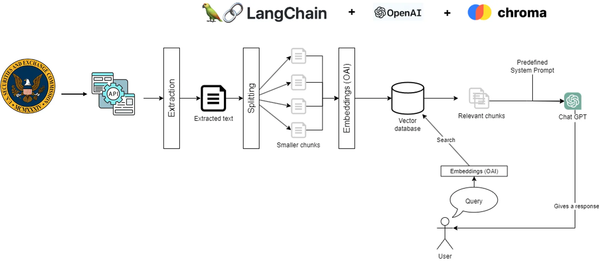
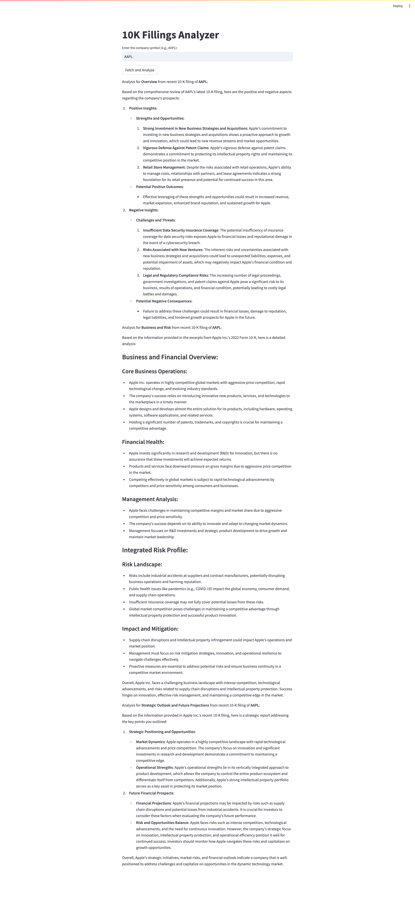

# 10K Filings Analyzer

This project is a Retrieval-Augmented Generation (RAG) based LLM application for analyzing 10K filings, aimed at providing financial insights into a particular company based on its 10K filings.

Retrieval-Augmented Generation (RAG) is an AI framework that enhances the quality of LLM-generated responses by leveraging external knowledge sources to supplement the model's internal information representation.

This project utilizes Streamlit for the frontend and Streamlit Community Cloud for deployment.

The workflow is straightforward: the user inputs a symbol (e.g., AAPL) and presses the "Fetch and Analyze" button. The application then displays financial insights based on the recent years' 10K filings.

## Architecture Overview



## Tech Stack and Rationale

- Basic Library: LangChain, BeautifulSoup
  - **LangChain**: A widely used open-source framework for building applications with LLMs.
  - **BeautifulSoup**: A Python package to parse HTML from 10K filings.
- Large Language Model: gpt-3.5-turbo-0125
  - **gpt-3.5-turbo-0125**: The latest iteration of the GPT-3.5 Turbo model, known for higher accuracy in specific formatting requests.
- Vector Database: Chroma
  - **Chroma**: A widely utilized open-source embedding database for AI-native applications.
- Frontend: Streamlit
  - **Streamlit**: Offers excellent support for building generative AI apps, managing all the HTML/CSS/JavaScript aspects.
- Deployment: Streamlit Community Cloud
  - **Streamlit Community Cloud**: Enables easy deployment of Streamlit apps with just a few clicks, ideal for experimental applications.

## Financial Insight

The application provides financial insights based on 10K filings.

Due to input token limitations, it focuses on the following five items, which effectively reflect the company's current state:

- Item 1: Business Overview
- Item 1A: Risk Factors
- Item 7: Management’s Discussion and Analysis
- Item 7A: Quantitative and Qualitative Disclosures About Market Risk
- Item 8: Financial Statements

The financial insight focuses on three aspects:

- Highlighting three positive and three negative aspects regarding the company's prospects, based on the recent year's 10K filings.
- Providing business and risk analysis of the company.
- Offering a strategic outlook and future projections of the company.

## App Deployed on the Cloud

- ```https://financial-report-analyser.streamlit.app/```

- Sample output of AAPL



## Steps to Use Locally

- Install the dependencies:

```pip install -r requirements.txt```

- Delete the unneccessary import in `frontend.py` if you are a mac user.

```
__import__('pysqlite3')
import sys
sys.modules['sqlite3'] = sys.modules.pop('pysqlite3')
```

- Build and open the frontend application:

```streamlit run frontend.py```
